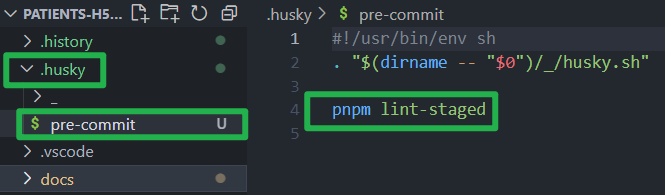
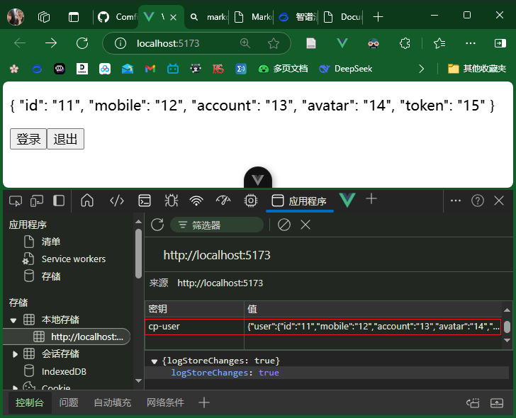

<link rel="stylesheet" href="//cdn.jsdelivr.net/npm/docsify/themes/dark.css">

# 项目起步

## 配置npm源

在终端运行下面命令，切换为淘宝源

```bash
npm config set registry https://registry.npmmirror.com/
```

<hr>

## 创建vue项目

1. 创建指令

```bash
pnpm create vue
```

2. 选择项目依赖

```bash
Vue.js - The Progressive JavaScript Framework

√ 请输入项目名称： ... patients-h5-100
√ 是否使用 TypeScript 语法？ ... 否 / 是
√ 是否启用 JSX 支持？ ... 否 / 是
√ 是否引入 Vue Router 进行单页面应用开发？ ... 否 / 是
√ 是否引入 Pinia 用于状态管理？ ... 否 / 是
√ 是否引入 Vitest 用于单元测试？ ... 否 / 是
√ 是否要引入一款端到端（End to End）测试工具？ » 不需要
√ 是否引入 ESLint 用于代码质量检测？ » 是
√ 是否引入 Prettier 用于代码格式化？ ... 否 / 是

正在初始化项目 C:\Users\ZZX\patients-h5-100...

项目初始化完成，可执行以下命令：

  cd patients-h5-100
  pnpm install
  pnpm format
  pnpm dev
```

## 创建文档

此处使用[docify](https://docsify.js.org/#/zh-cn/quickstart)记录文档，详见文档

全局安装 `docsify-cli` 工具

```bash
npm i docsify-cli -g
```

初始化项目文档

```bash
docsify init ./docs
```

启动文档

```bash
docsify serve docs
```

<hr>

## 配置ESLint

我用到的是Vue.js的官方 ESLint 插件`eslint-plugin-vue`
运行如下命令, 安装`eslint-plugin-vue`:

```bash
pnpm install --save-dev eslint eslint-plugin-vue
```

<br>

安装成功后, 配置 `eslint.config.js` 即可, 该文件在创建项目后会自动生成

直接用下面的代码覆盖 `eslint.config.js` 即可

```js
import pluginVue from 'eslint-plugin-vue'
export default [
	...pluginVue.configs['flat/recommended'],
	{
		rules: {
			'vue/no-unused-vars': 'error',

			// 组件名称始终为多个单词，否则报警告
			'vue/multi-word-component-names': [
				'warn',
				{
					// 忽略index组件名，允许存在
					ignores: ['index']
				}
			],
			// 禁止使用导致传递给 setup 的 props 失去响应性的用法
			// 原方法为 vue/no-setup-props-destructure 现已弃用
			'vue/no-setup-props-reactivity-loss': ['off'],

			// 未定义变量，报错
			'no-undef': 'error'
		}
	}
]
```

<hr>

## 配置prettier

在vscode中下载的`prettier`插件，随后在`.prettierrc.json`文件中配置规则
要想实现保存自动格式化，需要在`vscode`设置中开启

```json
{
	"$schema": "https://json.schemastore.org/prettierrc",
	"semi": false,
	"singleQuote": true,
	"printWidth": 100
}
```

## 代码检查工作流

安装husky

```bash
pnpm dlx husky-init && pnpm install
```

安装lint-staged

```
pnpm i lint-staged -D
```

配置`package.json`


将`.husky`目录下的`pre-commit`文件中的`npm test`改为`pnpm lint-staged`



## 调整项目结构

```
./src
├── assets        `静态资源，图片...`
├── components    `通用组件`
├── composable    `组合功能通用函数`
├── icons         `svg图标`
├── router        `路由`
│   └── index.ts
├── services      `接口服务API`
├── stores        `状态仓库`
├── styles        `样式`
│   └── main.scss
├── types         `TS类型`
├── utils         `工具函数`
├── views         `页面`
├── main.ts       `入口文件`
└──App.vue       `根组件`

```

项目使用sass预处理器，安装sass，即可支持scss语法：

```
pnpm add sass -D
```

## 安装vant组件库

这里我们用vant4

安装vant

```
pnpm add vant
```

在这里，我使用的是[文档](https://vant-ui.github.io/vant/#/zh-CN/quickstart)中的 方法二. 按需引入组件样式

安装`unplugin-vue-components`插件

```
pnpm add @vant/auto-import-resolver unplugin-vue-components unplugin-auto-import -D
```

配置插件后的vite.config.js

```
import { fileURLToPath, URL } from 'node:url'
import { defineConfig } from 'vite'
import vue from '@vitejs/plugin-vue'
import vueDevTools from 'vite-plugin-vue-devtools'
import AutoImport from 'unplugin-auto-import/vite'
import Components from 'unplugin-vue-components/vite'
import { VantResolver } from '@vant/auto-import-resolver'

// https://vite.dev/config/
export default defineConfig({
  plugins: [
    vue(),
    vueDevTools(),
    AutoImport({
      resolvers: [VantResolver()],
    }),
    Components({
      resolvers: [VantResolver()],
    }),
  ],
  resolve: {
    alias: {
      '@': fileURLToPath(new URL('./src', import.meta.url)),
    },
  },
})
```

因为我们是基于vite的项目，所以要在`vite.config.js`中配置

如果是基于`vue-cli`的，则需要在`vue.config.js`中配置

建议阅读官方文档,网上搜索到的博客可能已经过时,或者并不是你需要的,导致浪费时间

随后我们在`vue.app`中导入一个`van-button`进行测试，成功：


此时main.ts会有一个报错：
`无法找到模块“./App.vue”的声明文件。“c:/Users/ZZX/Desktop/gcyh3/patients-h5-100/src/App.vue”隐式拥有 "any" 类型。`

原因是ts不识别.vue文件

在`env.d.ts`（无则创建）输入以下内容：

```typescript
/// <reference types="vite/client" />

declare module '*.vue'
```

## 移动端适配——vw

安装 postcss-px-to-viewport

```
pnpm add -D postcss-px-to-viewport
```

配置： postcss.config.js

```
// eslint-disable-next-line no-undef
module.exports = {
  plugins: {
    'postcss-px-to-viewport': {
      // 设备宽度375计算vw的值
      viewportWidth: 375,
    },
  },
};
```

## 主题色

在style/main.css中配置：

```css
:root {
	/* 定义一系列颜色变量，用于问诊患者的界面设计 */

	/* 主要颜色，通常用于重要按钮或链接 */
	--cp-primary: #16c2a3;

	/* 简单背景颜色，可能用于轻量级容器或卡片 */
	--cp-plain: #eaf8f6;

	/* 橙色，可能用于警告或需要用户注意的元素 */
	--cp-orange: #fca21c;

	/* 文本颜色1，通常用于最重要的标题或文本 */
	--cp-text1: #121826;

	/* 文本颜色2，可能用于副标题或次要文本 */
	--cp-text2: #3c3e42;

	/* 文本颜色3，可能用于辅助信息或小号文本 */
	--cp-text3: #6f6f6f;

	/* 标签颜色，可能用于分类标签或小图标文字 */
	--cp-tag: #848484;

	/* 深色色调，可能用于分隔线或次级按钮 */
	--cp-dark: #979797;

	/* 提示颜色，可能用于提示性文字或图标 */
	--cp-tip: #c3c3c5;

	/* 禁用状态颜色，用于表示不可点击或不可用的元素 */
	--cp-disable: #d9dbde;

	/* 分隔线颜色，用于划分不同内容区域 */
	--cp-line: #ededed;

	/* 背景颜色，用于页面或组件的背景 */
	--cp-bg: #f6f7f9;

	/* 价格颜色，用于显示价格信息 */
	--cp-price: #eb5757;

	/* 覆盖vant UI库的主要颜色，将其设置为自定义的主要颜色 */
	--van-primary-color: var(--cp-primary);
}
```

测试代码：

```vue
<script setup lang="ts"></script>

<template>
	<!-- 测试vant颜色覆盖是否生效 -->
	<van-button type="primary">你好</van-button>
	<a href="#">你好</a>
</template>

<style scoped lang="scss">
a {
	color: var(--cp-primary);
}
</style>
```

测试发现没有生效，但是我们明明已经在`main.scss`修改了`--van-primary-color`，怎么回事呢？


查阅按钮样式的时候，发现`--van-primary-color`确实没有生效


为了解决这个问题，我在`--van-primary-color`后增加了`!important`

```scss
/* 覆盖vant UI库的主要颜色，将其设置为自定义的主要颜色 */
--van-primary-color: var(--cp-primary) !important;
```

## 用户状态仓库

> 目标：建立用户信息仓库

后期发送请求时，需要携带用户的token，故先实现用户状态仓库

用户状态仓库需求：

- 存储用户信息
- 设置用户信息
- 清空用户信息

在存储用户信息之前，我们定义一个**用户信息数据类型：**`user.d.ts`

`types/user.d.ts`

```typescript
export type User = {
	token: string // 令牌
	id: string // 用户ID
	account: string // 用户名
	mobile: string // 手机号
	avatar: string // 头像URL
}
```

关于对用户信息的具体操作（存储、设置、清空），我们定义一个用户管理 store

`stores/user.ts`

```typescript
import { ref } from 'vue'
import { defineStore } from 'pinia'
import type { User } from '@/types/user'

export const useUserStore = defineStore('cp-user', () => {
	// 存储当前用户状态
	const user = ref<User>()

	// 设置用户信息
	const setUser = (u: User) => {
		user.value = u
	}

	// 清空用户状态
	const delUser = () => {
		user.value = undefined
	}

	return { user, setUser, delUser }
})
```

别忘了返回 store 中的状态和方法，否则其他组件无法通过 useUserStore 函数调用

## 数据持久化

> 使用 `pinia-plugin-persistedstate` 实现pinia仓库状态持久化

安装 `pinia-plugin-persistedstate`

```bash
pnpm i pinia-plugin-persistedstate
```

在 `main.ts` 中导入 `pinia-plugin-persistedstate`


别忘了在 `stores/user.ts` 中新增 `persist` 为 `true`

```typescript
import { ref } from 'vue'
import { defineStore } from 'pinia'
import type { User } from '@/types/user'

export const useUserStore = defineStore(
	'cp-user',
	() => {
		// 存储当前用户状态
		const user = ref<User>()

		// 设置用户信息
		const setUser = (u: User) => {
			user.value = u
		}

		// 清空用户状态
		const delUser = () => {
			user.value = undefined
		}

		return { user, setUser, delUser }
	},
	// 持久化
	{
		persist: true
	}
)
```

在 `App.vue` 中测试持久化

```html
<script setup lang="ts">
import { useUserStore } from './stores/user'
const store = useUserStore()
</script>

<template>
	<p>{{ store.user }}</p>
	<button
		@click="store.setUser({ id: '11', mobile: '12', account: '13', avatar: '14', token: '15' })">
		登录
	</button>
	<button @click="store.delUser()">退出</button>
</template>
```

功能测试




# husky提交，代码突然全都没了！！！！！
本想在提交之前用husky规避掉不规范的提交，有报错告诉我哪里错了，我去改

没成想一看资源管理器，新写的代码都没了，本地项目好像自动回退到了上一个commit ......

#### 有问题，应该好好看报错...  这里只放出 lint-staged 部分

```bash
ZZX@DESKTOP-EVVUA5G MINGW64 ~/Desktop/gcyh3/patients-h5-100 (main)
$ git commit -m "user仓库建立，数据持久化"

> patients-h5-100@0.0.0 lint-staged C:\Users\ZZX\Desktop\gcyh3\patients-h5-100
> lint-staged

✔ Preparing lint-staged...
⚠ Running tasks for staged files...
  ↓ package.json — no tasks to run
  ↓ package.json — no tasks to run
  ↓ package.json — no tasks to run
  ↓ package.json — no tasks to run
  ↓ package.json — no tasks to run
  ❯ package.json — 44 files (chunk 6/9)...
    ❯ *.{js,ts,vue} — 11 files
      ✖ eslint --fix [FAILED]
  ❯ package.json — 44 files (chunk 7/9)...
    ❯ *.{js,ts,vue} — 44 files
      ✖ eslint --fix [FAILED]
  ✔ package.json — 44 files (chunk 8/9)...
  ❯ package.json — 44 files (chunk 9/9)...
    ❯ *.{js,ts,vue} — 21 files
      ✖ eslint --fix [FAILED]
↓ Skipped because of errors from tasks.
✖ <stdin>:162: trailing whitespace.
## 创建文档
<stdin>:530: trailing whitespace.
## 创建文档
<stdin>:898: trailing whitespace.
## 创建文档
<stdin>:1266: t…
↓
  ✖ lint-staged failed due to a git error.

  ✖ lint-staged failed due to a git error.
  Any lost modifications can be restored from a git stash:

    > git stash list
    stash@{0}: automatic lint-staged backup
    > git stash apply --index stash@{0}
```
在最后，日志最后提供了恢复可能丢失的修改的建议。
开发者可以通过 Git 命令 `git stash list` 查看保存的更改，并通过 `git stash apply --index stash@{0}` 命令恢复这些更改。

但是直接执行 `git stash pop` 出现了报错：


（先别管那红色的大长条文件...等下会修复）

就是说 `components.d.ts` 在归并后会被覆写，要挪走。挪走后再执行，然后就找回了迷失的代码（虽然它们一直在那儿）

然后又出现了成片的绿色，成片的红色...
绿色的提示，你回归到了之前保存的状态时，这些即将被提交的更改被列出


红色的提示，表示更改过但还没有add

这些是红色的md文件是 `Local History` 插件生成的，他们共同属于 `.history` 目录 ，我不想让这些文件届时也被上传到github

由于 `.history` 已经被cached，所以如果直接把他加入 `.gitignore` ，并不会生效，应先从cached移除

```bash
git rm -r .history
```

发现是 `eslint.config.js` 文件的配置有问题，导致了commmit失败

## pinia实例抽取

> 封装pinia相关内容：创建、持久化

`stores/index.ts`


## 工具函数泛型封装

```
type Data<T> = {

  // 响应状态码
  code: number

  // 响应描述信息
  message: string

  // 实际响应数据
  data: T
}

// 请求工具函数
const request = <T>(url: string, method: Method = 'get', submitData?: object) => {
  return instance.request<T, Data<T>>({
    url,
    method,
    [method.toLowerCase() === 'get' ? 'params' : 'data']: submitData
  })
}
```

Data<T>为一泛型类型对象,这里的`const request = <T>(url: string, method: Method = 'get', submitData?: object)`中的T指代你期望从请求返回的数据类型。这意味着当你调用这个函数时，你可以指定你期望从服务器接收的数据类型。

说实话,我是不知道为啥要写成request<T, Data<T>>,直接写成<Data<T>>也行啊
