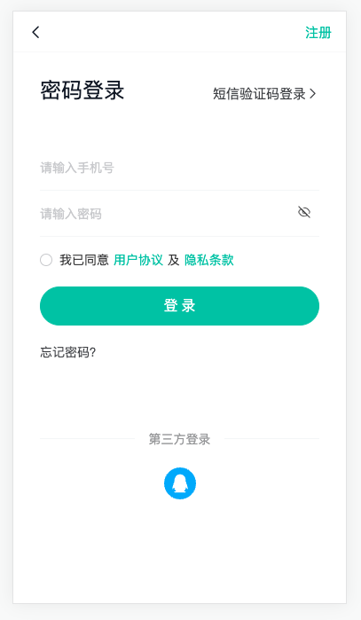
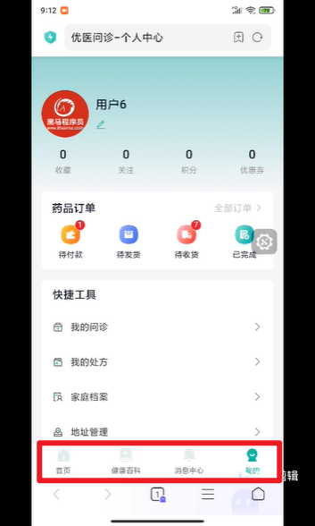
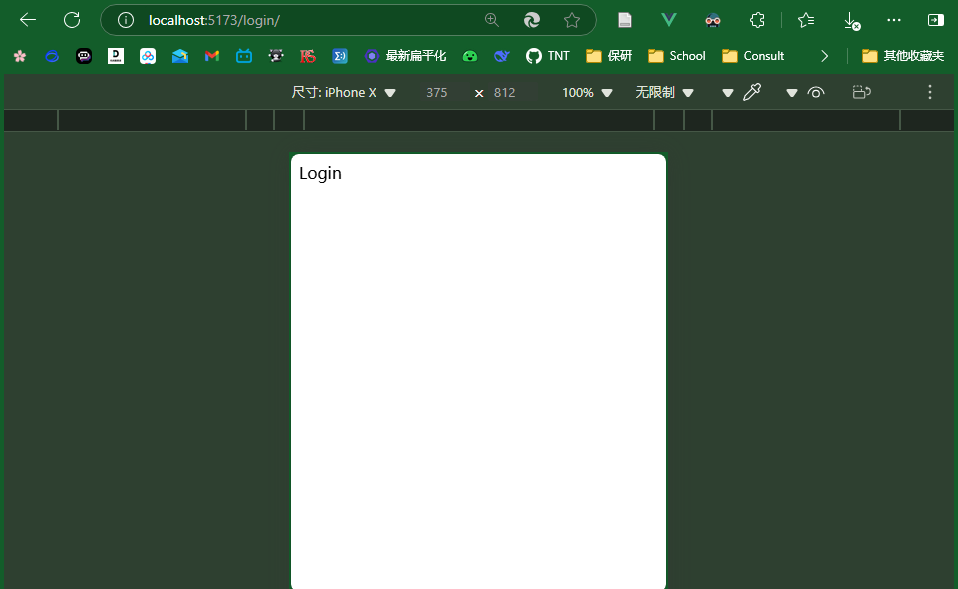
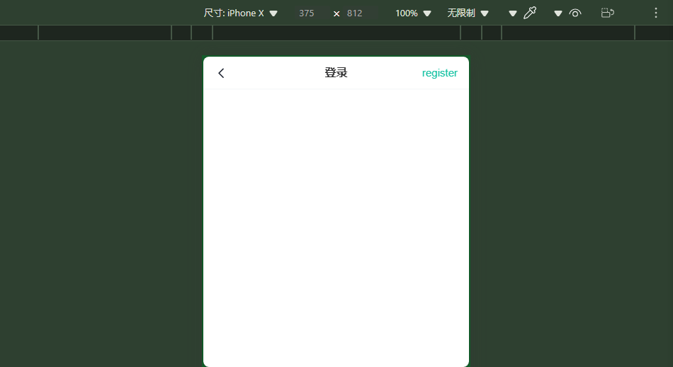
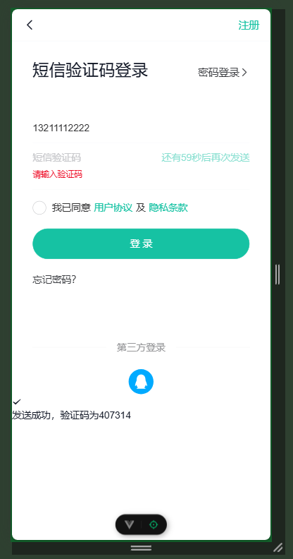

# 登录模块



## 约定路由规则

| 路由路径             | 路由级别 | 组件功能         |
| -------------------- | -------- | ---------------- |
| /login               | 1        | 登录             |
| /                    | 1        | 布局容器         |
| /user/patient        | 1        | 家庭档案         |
| /consult/fast        | 1        | 快速问诊         |
| /consult/dep         | 1        | 选择科室         |
| /consult/illness     | 1        | 病情描述         |
| /consult/pay         | 1        | 问诊支付         |
| /room                | 1        | 问诊室           |
| /user/consult        | 1        | 我的问诊         |
| /user/consult/:id    | 1        | 问诊详情         |
| /order/pay           | 1        | 药品订单支付     |
| /order/pay/result    | 1        | 药品订单支付结果 |
| /order/:id           | 1        | 药品订单详情     |
| /order/logistics/:id | 1        | 药品订单物流     |
| /login/callback      | 1        | QQ登录回跳       |
| /user                | 2        | 个人中心         |
| /home                | 2        | 首页             |
| /article             | 2        | 健康百科         |
| /notify              | 2        | 消息通知         |

`/user`、`/home`、 `/article`、 `/notify` 是二级路由，即登录后主页面进行切换的四个路由



## 配置登录路由规则

登录页面组件 `views/Login/index.vue`

```ts
<script setup lang="ts"></script>
<template>
  <div>Login</div>
</template>

<style lang="scss" scoped></style>
```

登录路由配置 `router/index.ts`

```
import Login from '@/views/Login/index.vue'
import { createRouter, createWebHistory } from 'vue-router'

const router = createRouter({
  history: createWebHistory(import.meta.env.BASE_URL),
  routes: [{ path: '/login', component: Login }]
})

export default router
```

`App.vue` 中添加路由出口

```
<script setup lang="ts"></script>
<template>
  <router-view></router-view>
</template>

<style lang="scss" scoped></style>
```

测试效果: `/login`



## 顶部导航栏 `CpNavBar`

`components/CpNavBar.vue`

```vue
<script setup lang="ts">
  import { useRouter } from 'vue-router'

  const router = useRouter()

  const onClickLeft = () => {
    if (history.state?.back) {
      router.back()
    } else {
      router.push('/')
    }
  }

  defineProps<{
    title?: string
    rightText?: string
  }>()

  const emit = defineEmits<{
    'click-right': []
  }>()

  const onClickRight = () => {
    emit('click-right')
  }
</script>
<template>
  <!-- 中间的title文字是由父组件传来的，title前别忘了冒号 -->
  <van-nav-bar
    :title="title"
    :right-text="rightText"
    left-arrow
    @click-left="onClickLeft"
    @click-right="onClickRight" />
</template>

<style lang="scss" scoped>
  :deep() {
    .van-nav-bar {
      // 箭头样式
      &__arrow {
        font-size: 18px;
        color: var(--cp-text1);
      }

      // 调节bar字大小
      &__text {
        font-size: 15px;
      }
    }
  }
</style>
```

利用NavBar导航栏，为了提升组件复用性，`title`和`right-text`由父组件传入

随后在`views/Login/index.vue`中调用该组件

```ts
<script setup lang="ts"></script>
<template>
  <CpNavBar
    title="登录"
    rightText="register"></CpNavBar>
</template>

<style lang="scss" scoped></style>
```

显示效果：


## 页面布局

### 重置全局样式 `style/main.scss`

原基础上增加以下内容：

```

```

出现的一个问题：vant的showToast样式突然没了：
原来是https://github.com/youzan/vant/issues/12709
自动导入才会导入相应的样式，所以你需要把手动导入的代码移除。


aria-hidden
装饰性元素：如果SVG图标仅仅是为了装饰目的，并不包含重要的交互信息或内容，那么设置 aria-hidden="true" 是合适的。
